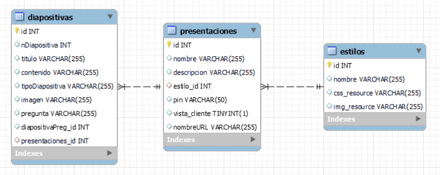

= Introducción

=== Integrantes:
* Andres Rojas.
* Guiu Puigantell.
* Diego Amador.

=== Objetivo de la aplicación:

El objetivo principal de nuestra aplicación web es brindar una nueva herramienta digital, potente, versatil e intuitiva para crear presentaciones y diapositivas de diferentes tipos, premitiendo transmitir y evaluar el conocimiento conforme se va impartiendo. La aplicación está dirigida para todas las personas, en especial a estudiantes y profesores de diferentes grados academicos, no se necesitan conocimientos especializados o dedicados para el manejo y uso de nuestra aplicación.
La función base de nuestra aplicación es resolver la necesidad de los alumnos y/o profesores a la hora de realizar sus presentaciones o apuntes de una forma más rapida, dinámica, intuitiva y entretenida, ahorrandoles tiempo, esfuerzo y asi mismo haciendo su trabajo mas eficiente.

= Recogida de requisitos

== Requisitos funcionales

* Se pueden crear presentaciones, a las cuales se les puede dar un título, una descripción, un PIN y un estilo ya predeterminado en el sistema.

* Se pueden crear diapositivas para las presentaciones previamente creadas, la aplicación cuenta con cuatro tipos diferentes de diapositivas:
    ** Diapositiva de tipo Título.
    ** Diapositiva de tipo Título con contenido.
    ** Diapositiva de tipo Título con contenido e imagen.
    ** Diapositiva de tipo Pregunta de opción multiple y única respuesta.

* La diapositiva de tipo Pregunta de opción multiple y única respuesta, tendrá una segunda diapositiva asociada donde se mostrará la respuesta correcta y esta diapositiva solo será visible sí se ha respondido a la diapositiva pregunta a la que está asociada.  

* Habrá una pantalla principal donde se mostrarán todos las presentaciones creadas.

* Las presentaciones creadas se podrán editar. Se podrá editar el título y la descripción de la presentación, crear nuevas diapositivas, eliminar diapositivas ya existentes y cambiar el estilo de la presentación.

* Las diapositivas de una presentación se pueden reordenar según las necesidades del usuario.

* Se podrá eliminar presentaciones creadas desde la pantalla principal.
 
* Se podrá hacer una vista previa de la presentación desde la pantalla de crear o editar presentación.

* Se podrá hacer una vista previa de una diapositiva desde la pantalla crear diapositiva.

* Las presentaciones se podrán publicar. Esta opción estará disponible en la pantalla principal y en la pantalla editar presentación.

* Las presentaciones publicadas se diferenciarán de las no publicadas en la pantalla principal por medio de un color diferente y la dehabilitacion del botón correspondiente. 

* Al publicar una presentación se genera un URL única que se utilizará para acceder a la vista cliente de la presentación. Sí la presentación tiene un PIN definido, se pedirá al usuario que lo introduzca para poder ver la presentación, de lo contrario accederá directamente a la pantalla que muestra las diapositivas asociadas a dicha presentación.

== Requisitos no funcionales

* Utilizar MySQL como sistema de gestión de base de datos.
* Utilizar HTML5 y CSS3 para crear la vista de las pantallas.
* Lenguaje de progrmación de la parte cliente JavaScript vainilla.
* Lenguaje de programación de la parte servidor PHP vainilla.
* Acceso a base de datos con PHP mediante PDO. 

= Guia de estilos de la aplicación.

.Consejo:
[TIP]
====
En el siguiente enlace, puede encontrar toda la información a detalle de la guia de estilos de la aplicación https://www.figma.com/file/zsd5pKIhJCn0qppo3LQtNn/paleta-de-Colores?type=design&node-id=0-1&mode=design&t=hAT3cF6vksNfLXLY-0[Guia de estilos]
====

=== Tipografia.

.Consejo:
[TIP]
====
Para más detalle de la tipografía, puede encontrarla en el siguiente enlace https://fonts.google.com/[Google Fonts]
====

=== Iconos de la aplicación.

.Consejo:
[TIP]
====
Para más detalle de la iconografía, puede encontrarla en el siguiente enlace https://fonts.google.com/icons[google Icons]
====

== Estructura de la base de datos.

== Pantallas de la aplicación, Sketching y Mockups

.Consejo:
[TIP]
====
Para ver los detalles de los Sketching y Mockups, puede dirigirse al siguiente enlace https://www.figma.com/file/Q052khG2YlsnMfOP3QerrB/Slides-Grupo-%236?type=design&node-id=0-1&mode=design&t=8SmZv0ChilCKd7s0-0[Sketching y Mockups]
====

== Flujo de la aplicación

.Consejo:
[TIP]
====
Puede encontrar la información del flujo de la aplicación en el siguiente enlace https://www.figma.com/file/Q052khG2YlsnMfOP3QerrB/Slides-Grupo-%236?type=design&node-id=0-1&mode=design&t=Hep37TzuexxctwVn-0[Flujo de la aplicación]
====

= Tareas realizadas.

== Semana uno.

=== Diego:
- [*] Revisión de la configuración del GIT.
- [*] Estructura base de datos.
- [*] configuración del figma.
- [*] Estructura de clases PHP.
- [*] validaciones JS pantalla "crearDiapositiva".
- [*] Pantalla home.
- [*] Definir guía de estilos de la aplicación.
- [*] Creación y actualización de la memoria.

=== Andrés:
- [*] Estructura base de datos.
- [*] Sigleton para hacer conexión con base de datos.
- [*] HTML página creación de presentaciones.
- [*] CSS página creación de presentaciones.
- [*] Validación de datos de creación de presentaciones en JavaScript.
- [*] Validación de datos de creación de presentaciones en PHP.

=== Guiu:
- [*] Estructura base de datos.
- [*] Vagrant file para crear el servidor y la base de datos.
- [*] HTML página creación de diapositivas.
- [*] CSS página creación de diapositivas.
- [*] JavaScript para saber que diapositiva seleccionamos en el home al añadir diapositiva.
- [*] Php Controlador pantalla crear diapositivas.
- [*] Inserts a la base de datos.

== Semana dos.

=== Diego:
- [*] Dar funcionalidad al botón eliminar presentación.
- [*] Confirmación de la eliminación (modal con botones aceptar y cancelar).
- [*] Pop up - modal, informando el estado de la eliminación (feedBack).
- [*] Dar funcionalidad botón "editar" de las presentaciones en la pantalla "home".
- [*] Modificar campo "nombre" (precargar el que ya existe).
- [*] Modificar campo "descripción" (precargar el que ya existe).
- [*] Crear botón "nueva diapositiva (redirecciona a la pantalla crear Diapositiva).
- [*] Mostrar diapositivas existentes.
- [*] Eliminar diapositivas (debe tener confirmación).
- [*] Reordenar diapositivas (drag & drop).
- [*] Modificar estilo de las presentaciones.

=== Andrés:
- [*] Funcionalidad "Cambiar Estilo" pantalla Editar Presentación.
- [*] paddin botones aceptar eliminar presentación.
- [*] Creación tabla "estilos" en base de datos.
- [*] Creación paginas estilos 1 y 2.
- [*] Creación de hojas de estilos 1 y 2.
- [*] Refactor pagina crear presentacion con la opción de los estilos para las presentaciones a crear.

=== Guiu:
- [*] Vista previa de una diapositiva.
- [*] Agrandar mostrar diapositiva.
- [*] Vista previa de una presentación.
- [*] Despliegue de la aplicación en el servidor. 

== Semana tres.

=== Diego:
- [*] Crear pagina vista cliente.
- [*] Crear controlador pantalla vista cliente.
- [*] Crear pantalla 404.
- [*] Crear hoja de estilos pantalla 404.
- [*] Boton compartir presentación desde la pagina home.
- [*] Dar estilo a presentaciones compartidas para diferenciar.
- [*] Funcion JS que cambia el valor de las presentaciones compartidas.

=== Andrés:
- [*] Crear funcionalidad del pin.
- [*] Crear pagina de validacion del pin.
- [*] Crear controlador de la pagina comprobar pin.
- [*] Actualización memoria con requisitos funcionales y no funcionales.

=== Guiu:
- [*] Diapositivas tipo imagen en la vista cliente.
- [*] Vista cliente ver contenido imagen.
- [*] Estilo crear diapositiva crezca dependiendo del contenido
- [*] Requerimiento 14 Diapositivas con imagen.

== Semana cuatro.

=== Diego:
- [*] Cambiar contenido que muestra las preguntas en la pantalla inicioPresentación
- [*] Pantalla crear Diapositivas con preguntas de selección simple.
- [*] Pantalla editar presentación - Diapositivas con preguntas de selección simple resueltas.
- [*] Actualización memoria líneas futuras.

=== Andrés:
- [*] Bloquear respuestas una vez contestada
- [*] Visualización de las diapositivas con pregunta de selección simple en la vista cliente.
- [*] Actualización memoria conlusiones.

=== Guiu:
- [*] Poner nuevos numeros a las diapositivas despues de borrar un tipo test en editar presentación.
- [*] Previsualización de las Diapositivas con pregunta de selección simple.
- [*] Ocultar respuesta sí no se contesta.
- [*] La vista cliente permite mostrar las miniaturas de todas las diapositivas de la presentación.

= Maual de usuario
La aplicación es fácil de usar, simplemente hay que tener en cuenta estos casos:

-> No se puede previsualizar una diapositiva con imagen, ya que no cargara la imagen.

-> No utilices caracteres especiales como ; porque daría error al mostrar las diapositivas.

-> Para ver una presentación publicada tienes que usar esta url:

	IPDelServidor/vista/inicioPrsentacion.php?url={1}_{2}
	{1} = nombre de la presentación.
	{2} = número de caracteres de la presentación

	p.e. localhost/vista/inicioPresentacion.php?url=presentacion_12

= Líneas futuras

Durante la realización de la aplicación, el equipo de desarrollo, identificó varias mejoras a nivel de codigo y diseño que podrán ser aplicadas en las proximas versiones.

== General:
* Diseño de los titulos y labels de la aplicación.
* Generación de objetos a partir de la información extraida desde la base de datos para el manejo interno de los controladores y la vista.
* Estructuración integral del patrón de diseño Modelo-Vista-Controlador.
* Limitar al minimo el uso de variables de sesión y cookies.

== Pantalla Home:
* Tool tip que muestre la descripción de cada presentación al ubicar el ratón sobre estas.
* Mostrar y/o copiar la URL generada al compartir la aplicación.

== Pantalla Crear presentación:
* Ajustar el tamaño de las flechas de desplazamientos de los estilos de las presentaciones.

== Pantalla Editar Presentación:
* Tooltips para los botones de las diapositivas.
* Tooltips para mostrar un breve resumen del contenido o el tipo de diapositiva al unicar el ratón sombre estas.
* Relación grafica y más intuitiva entre las diapositivas tipo pregunta y su respectiva respuesta.
* Desplazar y reordenar las diapositivas sin importar su ubicación.

== Comprobar PIN:
* Implementar un limite de intentos para la inserción y validacion del pin.

= Conclusiones.

* Con la realización de este proyecto hemos aprendido a utilizar lenguajes como JavaScript para la gestión de eventos y la interacción con el usuario, PHP para gestionar la información recibida por formulario y la conexión con la base de datos en MySQL. También hemos prendido a crear pantallas dinámicas. Además de obtener una experiencia cercana a lo que sería un ambiente laboral, con el trabajo en equipo, la organización de las tareas mediante Trello y la gestión del código mediante GitLab.  

= Bibliografía y recursos de consulta.
 
*

