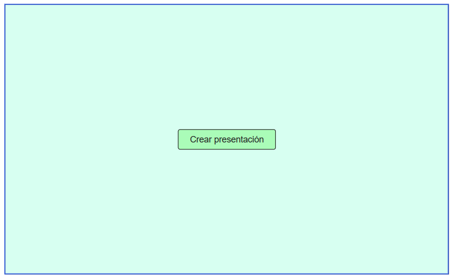
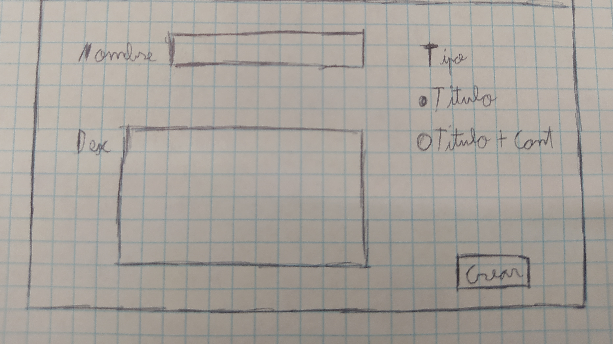
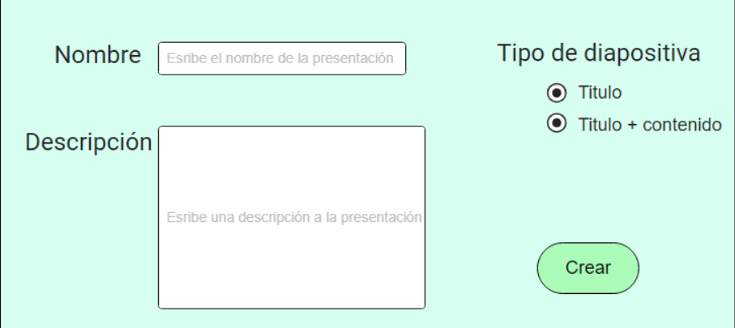
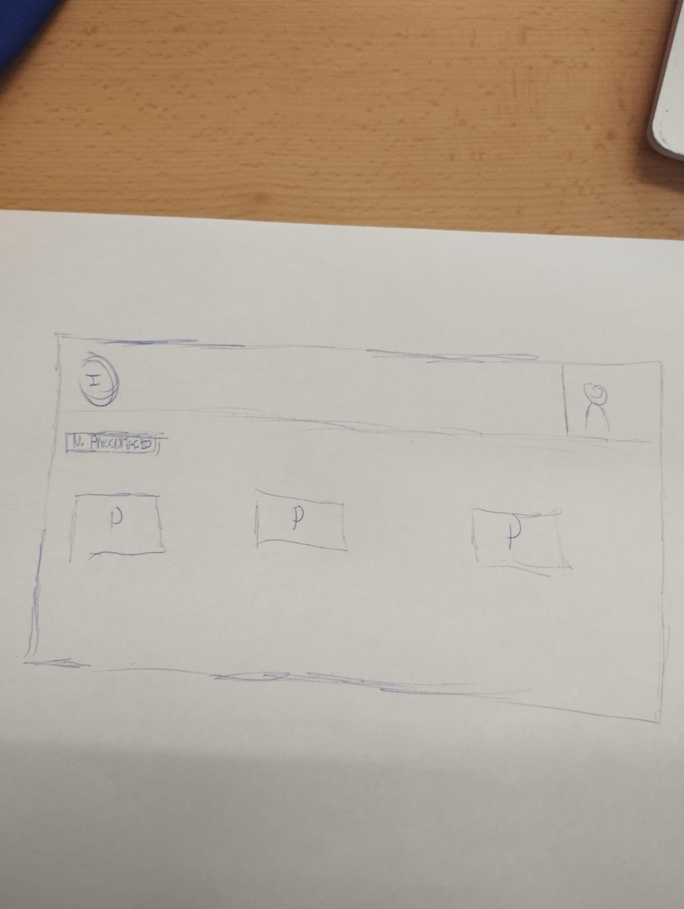

= Introducción

=== Integrantes:
* Andres Rojas
* Guiu Puigantell
* Diego Amador

=== Objetivo de la aplicación:

El objetivo es tener una página web capaz de crear presentaciones con diapositivas. Va dirigida sobre todo a estudiantes y profesores.
Resolvería la necesidad de los alumnos y/o profesores a la hora de hacer presentaciones o apuntes de una forma más dinámica y entretenida, ya que no sería un solo documento con mucho texto.

= Seguimiento semanal

= Sprint 1

== R01: Guia de estilos de la aplicación.

=== Paleta de colores.
La paleta de colores que tendrá nuestra aplicación de slides será una paleta monocromatica dentro del espectro del color purpura en diferentes tonalidades, el nombre de los colores, su valor hexadecimal y una muestra visual de cada color, se podrán ver en el siguiente enlace:

https://www.figma.com/file/zsd5pKIhJCn0qppo3LQtNn/paleta-de-Colores?type=design&node-id=0-1&mode=design&t=hAT3cF6vksNfLXLY-0[Paleta de Colores]

El color de de la fuente que se utilizará en la aplicación, será en primera instancia el color negro.

=== Tipografia.
Las tipografia seleccionada para la aplicación será la siguiente:

[options="header"]
|====================
| Nombre | Funcionalidad | Tamaño | Referencia Visual
| Roboto Black 900 | Titulo principal | 18px a| image::imagenes/titulos.png[Titulos Roboto Black 900]
|====================

=== Iconos de la aplicación.
La iconografía que se implementará dentro de la aplicación, se tomará del paquete de iconos que ofrece google de manera gratuita, ya que dispone de diversas maneras posibles para aplicar los iconos a una aplicación personalizada.
algunos de los iconos con los que dispondrá la aplicación y su respectivo nombre dentro del paquete de google son:

image::imagenes/iconos.png[iconos de la aplicación]

== R02: Estructura de la base de datos.
image::imagenes/estructura_base_de_datos.PNG[Tablas de la base de datos width=400,height=300]

== R03: Pantalla Home.

== R04: Pantalla _Crear_ Presenstación.
image::imagenes/PantallaCreacionPresentaciones.png[Moqup pantalla creación de presentaciones width=400,height=300]

== R05: Almacenar la Presenstación.
(...)

== R06: #Refactor# Pantalla Home.
(...)

= Base de datos

image::imagenes/BaseDeDatos.jpg[Tablas de la base de datos width=400,height=300]

= Sketching y Mockups

=== Pantalla creación presentaciones

image::imagenes/ScetchPantallaCreacionPresentaciones.jpg[Squetch pantalla creación presentaciones width=400,height=300]
image::imagenes/PantallaCreacionPresentaciones.png[Moqup pantalla creación de presentaciones width=400,height=300]
 
 
=== Pantalla creación diapositivas

=== Pantalla home

=== Pantalla diapositiva titulo

=== Pantalla diapositiva titulo y contenido

