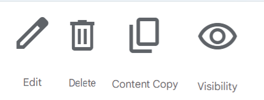

= Introducción

=== Integrantes:
* Andres Rojas
* Guiu Puigantell
* Diego Amador

=== Objetivo de la aplicación:

El objetivo es tener una aplicación web capaz de crear presentaciones con diapositivas. Va dirigida sobre todo a estudiantes y profesores.
Resolvería la necesidad de los alumnos y/o profesores a la hora de hacer presentaciones o apuntes de una forma más rapida, dinámica, intuitiva y entretenida, ahorrandole al usuario tiempo y esfuerzo y asi mismo haciendo su trabajo mas eficiente.

= Sprint 1

== Guia de estilos de la aplicación.

=== Paleta de colores.

La paleta de colores que tendrá nuestra aplicación de slides será una paleta monocromatica dentro del espectro del color purpura en diferentes tonalidades, el nombre de los colores, su valor hexadecimal y una muestra visual de cada color, se podrán ver en el siguiente enlace:

https://www.figma.com/file/zsd5pKIhJCn0qppo3LQtNn/paleta-de-Colores?type=design&node-id=0-1&mode=design&t=hAT3cF6vksNfLXLY-0[Paleta de Colores]

El color de de la fuente que se utilizará en la aplicación, será en primera instancia el color negro.

=== Tipografia.

Las tipografia seleccionada para la aplicación será la siguiente:

.Tipografia de la aplicación
[options="header"]
|====================
| Nombre | Funcionalidad | Tamaño | Referencia Visual
| Roboto Black 900 | Titulo principal | 18px a| image::imagenes/titulos.png[Titulos Roboto Black 900]
|====================

=== Iconos de la aplicación.

La iconografía que se implementará dentro de la aplicación, se tomará del paquete de iconos que ofrece google de manera gratuita, ya que dispone de diversas maneras posibles para aplicar los iconos a una aplicación personalizada.
algunos de los iconos con los que dispondrá la aplicación y su respectivo nombre dentro del paquete de google son:

.Iconos iniciales:

.Consejo:
[TIP]
====
Para más detalle de la iconografía, puede encontrarla en el siguiente enlace https://fonts.google.com/icons[google Icons]
====

== Estructura de la base de datos.
image::imagenes/estructura_base_de_datos.PNG[Tablas de la base de datos width=400,height=300]

== Pantallas Home, crearPresenstación y crearDiapositiva.
.Consejo:
[TIP]
====
Para ver los detalles de los Sketching y Mockups, puede dirigirse al siguiente enlace https://www.figma.com/file/Q052khG2YlsnMfOP3QerrB/Slides-Grupo-%236?type=design&node-id=0-1&mode=design&t=8SmZv0ChilCKd7s0-0[Sketching y Mockups]
====

==Tareas realizadas.

===Diego:
- [*] Revisión de la configuración del GIT.
- [*] Estructura base de datos.
- [*] configuración del figma.
- [*] Estructura de clases PHP.
- [*] validaciones JS pantalla "crearDiapositiva".
- [*] Pantalla home.
- [*] Definir guía de estilos de la aplicación.
- [*] Creación y actualización de la memoria.

