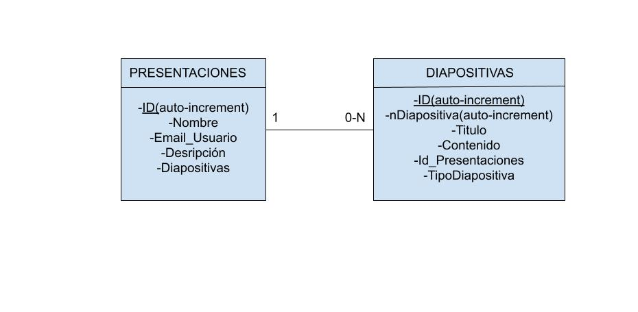
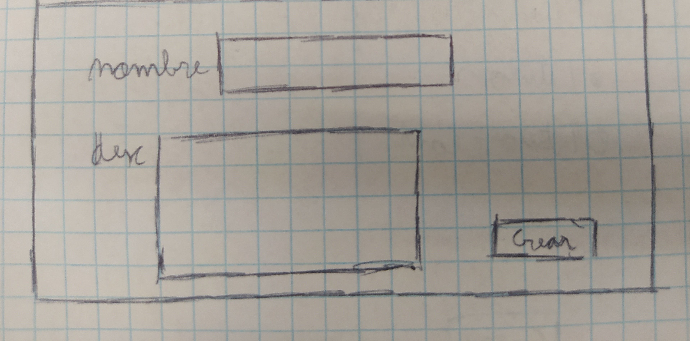
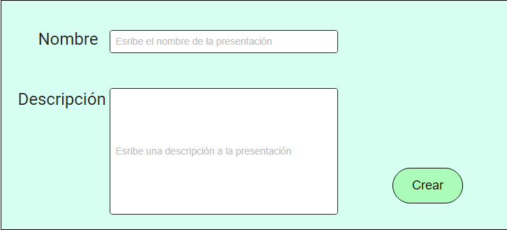

= Introducción

=== Integrantes:
* Andres Rojas
* Guiu Puigantell
* Diego Amador

=== Objetivo de la aplicación:

El objetivo es tener una página web capaz de crear presentaciones con diapositivas. Va dirigida sobre todo a estudiantes y profesores.
Resolvería la necesidad de los alumnos y/o profesores a la hora de hacer presentaciones o apuntes de una forma más dinámica y entretenida, ya que no sería un solo documento con mucho texto.

= Seguimiento semanal

=== Semana 1:
Esta primera semana hemos elegido los colores principales de la app y tipografía.

Realizado los scetch y moqups de la página.

Creamos el diseño y la base de datos inicial.

Creación e implementación de las pantallas:

* **Home**

* **Creación de presentaciones**

* **Creación de diapositivas**

* **Diapositivas(titulo y titulo + contenido)**

===== Andres:
R01: Definir guía de estilos de la aplicación

===== Guiu:
R01: Definir guía de estilos de la aplicación

===== Diego:
R01: Definir guía de estilos de la aplicación

= Base de datos

= Sketching y Mockups

=== Pantalla creación presentaciones

